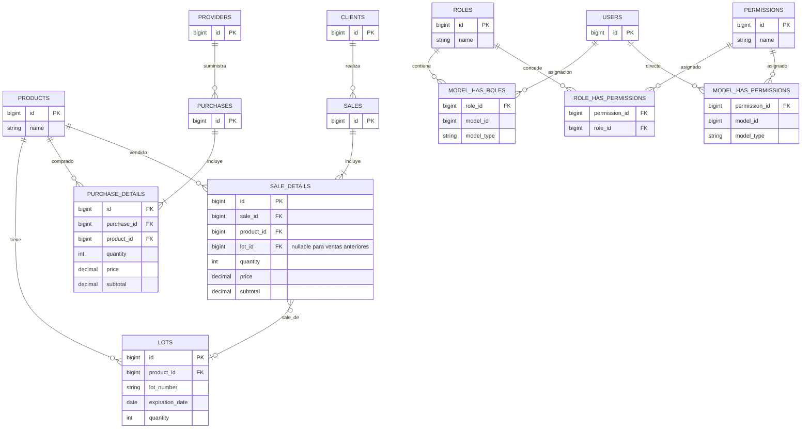

```mermaid
erDiagram
    PRODUCTS ||--o{ LOTS : tiene
    PROVIDERS ||--o{ PURCHASES : suministra
    PURCHASES ||--|{ PURCHASE_DETAILS : incluye
    PRODUCTS ||--o{ PURCHASE_DETAILS : comprado
    CLIENTS ||--o{ SALES : realiza
    SALES ||--|{ SALE_DETAILS : incluye
    PRODUCTS ||--o{ SALE_DETAILS : vendido
    SALE_DETAILS }o--o| LOTS : sale_de

    USERS ||--o{ MODEL_HAS_ROLES : asignacion
    ROLES ||--o{ MODEL_HAS_ROLES : contiene
    ROLES ||--o{ ROLE_HAS_PERMISSIONS : concede
    PERMISSIONS ||--o{ ROLE_HAS_PERMISSIONS : asignado
    USERS ||--o{ MODEL_HAS_PERMISSIONS : directo
    PERMISSIONS ||--o{ MODEL_HAS_PERMISSIONS : asignado

    PRODUCTS {
        bigint id PK
        string name
    }
    LOTS {
        bigint id PK
        bigint product_id FK
        string lot_number
        date expiration_date
        int quantity
    }
    PROVIDERS {
        bigint id PK
    }
    PURCHASES {
        bigint id PK
    }
    PURCHASE_DETAILS {
        bigint id PK
        bigint purchase_id FK
        bigint product_id FK
        int quantity
        decimal price
        decimal subtotal
    }
    CLIENTS {
        bigint id PK
    }
    SALES {
        bigint id PK
    }
    SALE_DETAILS {
        bigint id PK
        bigint sale_id FK
        bigint product_id FK
        bigint lot_id FK "nullable para ventas anteriores"
        int quantity
        decimal price
        decimal subtotal
    }
    USERS {
        bigint id PK
    }
    ROLES {
        bigint id PK
        string name
    }
    PERMISSIONS {
        bigint id PK
        string name
    }
    MODEL_HAS_ROLES {
        bigint role_id FK
        bigint model_id
        string model_type
    }
    ROLE_HAS_PERMISSIONS {
        bigint permission_id FK
        bigint role_id FK
    }
    MODEL_HAS_PERMISSIONS {
        bigint permission_id FK
        bigint model_id
        string model_type
    }
```